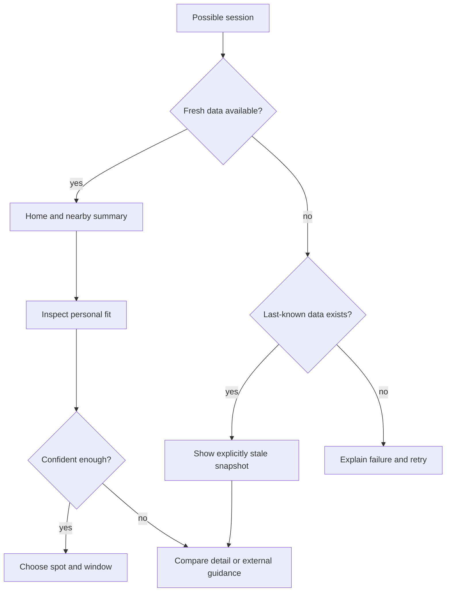

# Wireframes

These are product hypotheses, not implementation specifications. Values are placeholders and never imply live conditions.

## 1. Home decision — happy state

```text
┌──────────────────────────────┐
│ CheckMySurf        Updated 8m│
│ Plan with forecasts, not as  │
│ a safety guarantee.          │
├──────────────────────────────┤
│ ★ Home Beach                 │
│ FIT FOR YOU: CONDITIONAL     │
│ Best window  4–6 PM          │
│ + waves inside preference    │
│ – water below preference     │
│ [Why this fit?] [View detail]│
├──────────────────────────────┤
│ Nearby                       │
│ Beach B  Good later    [>]   │
│ Beach C  Missing swell [?]   │
└──────── Spots ─ Detail ─ ⚙ ──┘
```

Annotations: fit uses text plus icon, not color alone; “why” exposes inputs; update age sits beside decision content; safety boundary remains visible but quiet.

## 2. Explainable detail and edge input

```text
┌──────────────────────────────┐
│ ‹ Spots  Home Beach          │
│ Personal fit: CONDITIONAL    │
├──────────────────────────────┤
│ Preference       Forecast    │
│ Waves 1–6 ft     [range data]│
│ Cold: moderate   [temp data] │
│ Skill: intermediate          │
│ Skill is not a safety rating │
├──────────────────────────────┤
│ Hourly:  Now  3p  4p  5p  6p│
│          ?    ○   ●   ●   ○ │
│ ? One input is unavailable   │
│ [Source & freshness] [Retry] │
└──────────────────────────────┘
```

Edge state: incomplete inputs produce “unknown/conditional,” never a silently computed confident score.

## 3. Loading, empty, and error

```text
LOADING                       EMPTY
┌──────────────────────┐      ┌──────────────────────┐
│ Loading beach list…  │      │ No beaches available │
│ [skeleton rows]      │      │ This may be coverage │
│ Existing controls are│      │ or a data issue.     │
│ disabled and labeled │      │ [Retry] [Settings]   │
└──────────────────────┘      └──────────────────────┘

ERROR                         STALE FALLBACK
┌──────────────────────┐      ┌──────────────────────┐
│ Couldn’t refresh     │      │ Last known forecast  │
│ No current data shown│      │ Saved 2h ago — STALE │
│ [Retry] [Details]    │      │ [Retry] [View anyway]│
└──────────────────────┘      └──────────────────────┘
```

The stale fallback is a roadmap hypothesis and must be optically distinct from current data.

## 4. Settings with validation

```text
┌──────────────────────────────┐
│ Settings                     │
│ Home spot [Beach A       ▾]  │
│ Skill     [Intermediate  ▾]  │
│ Wave fit  1 ft ├─────●─┤ 6 ft│
│ Cold      [Moderate      ▾]  │
│                              │
│ Used to explain fit; values  │
│ stay on this device.         │
│ [Reset preferences]          │
└──────────────────────────────┘
```

Minimum and maximum must expose numeric accessible values and never cross; reset requires confirmation and preserves a cancel path.

## Journey flow



## Responsive and accessibility notes

- Support 320px phones through tablet split view; cards become two columns only when reading order remains obvious.
- At large text sizes, stack score, reason, and action; never truncate forecast age or errors.
- Provide screen-reader summaries for charts plus an equivalent list/table.
- Minimum touch target 44×44 points; star/home control has selected state and label.
- Respect reduced motion; refresh and skeleton animation are nonessential.
- Use locale-aware time, explicit time zone, and units selected by the user.
- Preserve focus after retry and announce loading completion/errors without repeated interruption.
